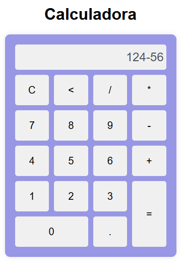
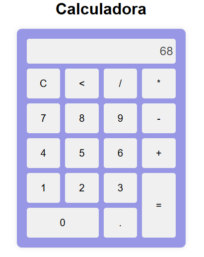
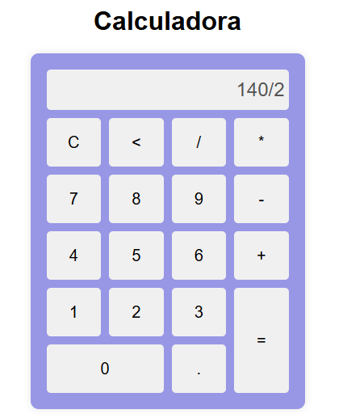

# Calculadora

Fizemos uma calculadora desenvolvida com HTML, CSS e JavaScript. A aplicação permite realizar as quatro operações matemáticas básicas:

* Soma (+)
* Subtração (-)
* Multiplicação (*)
* Divisão (/)

## Estruturas Utilizadas 

* HTML
* CSS
* JavaScript

### Estrutura HTML

Foi criado o campo (`display`) utilizando a tag `<input>` para mostrar os números digitados e os resultados das operações.

Os botões da calculadora foram criados com a tag `<button>`, e cada botão chama uma função JavaScript através do evento `onclick`.

### Estilização CSS

O CSS foi utilizado para:

* Centralizar a calculadora na tela utilizando Flexbox.
* Organizar os botões em formato de grade com CSS Grid.
* Aplicar cores, sombras e bordas arredondadas.
* Destacar o botão de resultado (`=`) e o botão zero.

### Funcionalidades JavaScript

Foram implementadas as seguintes funções:

#### appendToDisplay(valor)

Adiciona números e operadores ao visor da calculadora.

#### clearDisplay()

Limpa completamente o visor.

#### calculate()

Realiza o cálculo da expressão digitada utilizando a função `eval()`. Caso a expressão seja inválida, é exibida a mensagem "Erro".

#### back()

Remove o último caractere digitado no visor.

## Evidências

A seguir estão os prints da aplicação executando as operações:

### Soma

### Subtração

### Multiplicação

### Divisão

